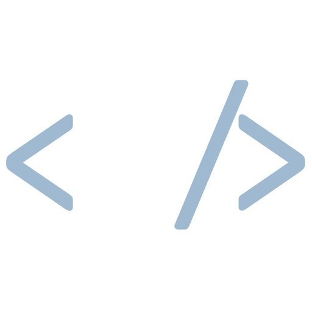

  

  
  

  
  
  
  
  
  

Hi there! This is my work portfolio. I welcome any feedback you might have. If you’re interested in working together, you can find my contact information and social media profiles below.

